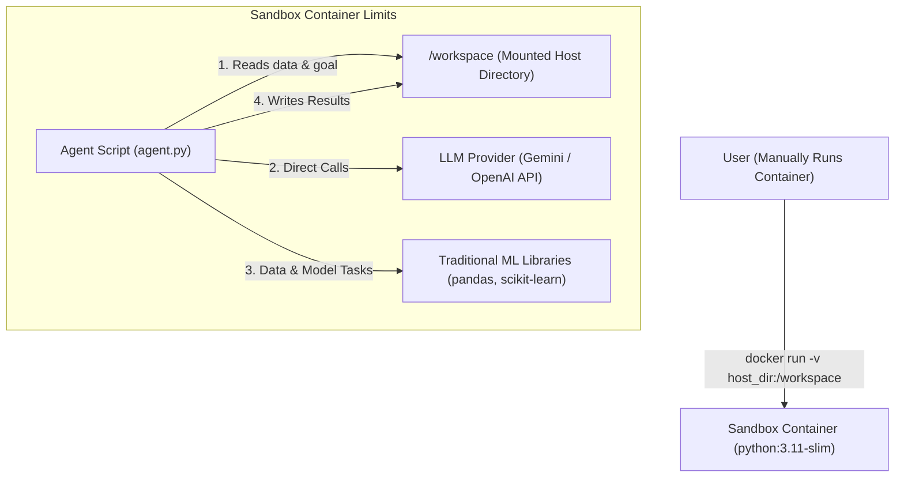

# Project Specification: TDD-Driven Sandbox Agent System

This document outlines the vision, architecture, and roadmap for building an autonomous Machine Learning (ML) agent that runs directly inside a Docker container.

---

## 1. Project Vision & Scope

The goal is to build an autonomous ML agent that is run inside a container. The user manually invokes the Docker container, mounting a directory that contains both the dataset and the task goal.

The agent's target capabilities are focused on:
1.  **Data Processing**: Cleaning datasets, handling missing values, scaling numeric inputs, and encoding categoricals.
2.  **Feature Selection**: Filtering out redundant features, analyzing correlation, and selecting informative variables.
3.  **Model Selection (Strictly Traditional ML)**: Running, evaluating, and tuning standard traditional models (e.g., Random Forests, XGBoost, and LightGBM) to find the best model for the mounted dataset.

All implementation steps follow an **atomic, Test-Driven Development (TDD)** approach.

---

## 2. System Architecture

There is no external host orchestrator script. Instead, the agent runs entirely inside the container sandbox:

### Components
*   **Host Directory Mount**: Contains the raw datasets, the task goal file, and the output results.
*   **Sandbox Container**: Python runtime containing the agent script (`agent.py`) and all necessary libraries (`pandas`, `scikit-learn`, `xgboost`, `lightgbm`).
*   **Agent Script (`agent.py`)**: Runs directly inside the container when invoked, communicating with the LLM API and performing local execution/computation inside the container.

---

## 3. Incremental Architectural Milestones

To avoid complexity, development progresses in atomic phases:

### Phase 1: Environment & Mounting (Completed ✅)
*   **Deliverables**: `setup_sandbox.sh`, `teardown.sh`, `verify_sandbox.sh`.
*   **TDD Validation**: Verify host-container directory sharing and read/write synchronization.

### Phase 2: Containerized Agent Base (Current Target 🎯)
*   **Deliverables**: Add `agent.py` inside the workspace (which is mounted into the container). Configure it to connect to the LLM API and successfully print sandbox system constraints.
*   **TDD Validation**: Run validation locally to ensure `agent.py` can communicate with the LLM from inside the Python sandbox environment.

### Phase 3: Data Processing & Feature Selection Capabilities
*   **Deliverables**: Integrate tools/functions in the agent script to allow the LLM to inspect, clean, and select features from `dataset.csv`.
*   **TDD Validation**: Provide a mock dataset and verify the agent writes a correctly structured, cleaned dataset back to `/workspace`.

### Phase 4: Model Selection & Traditional ML Training
*   **Deliverables**: Agent trains multiple traditional models, performs local cross-validation, selects the best model, and exports the final model artifacts.
*   **TDD Validation**: Verify model accuracy meets benchmark expectations.
